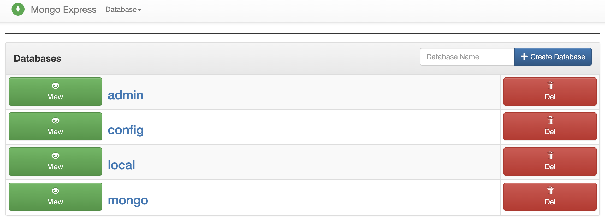
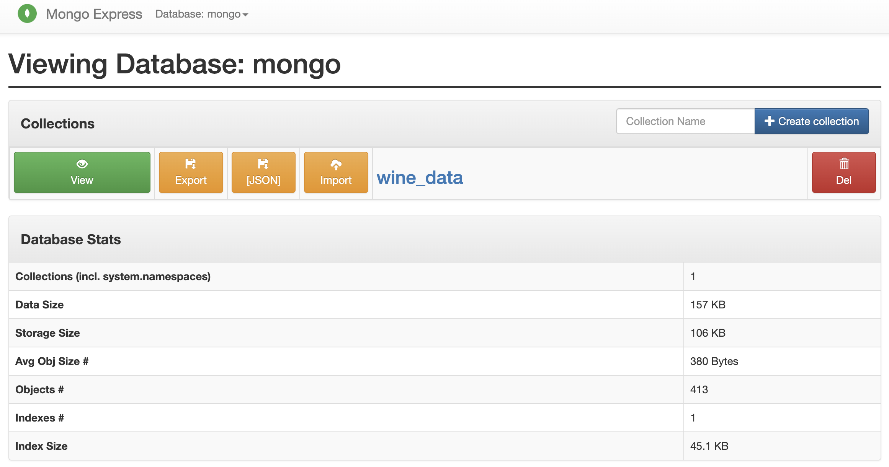
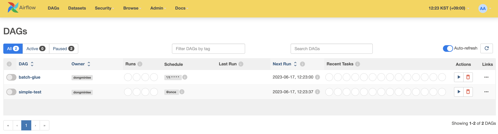
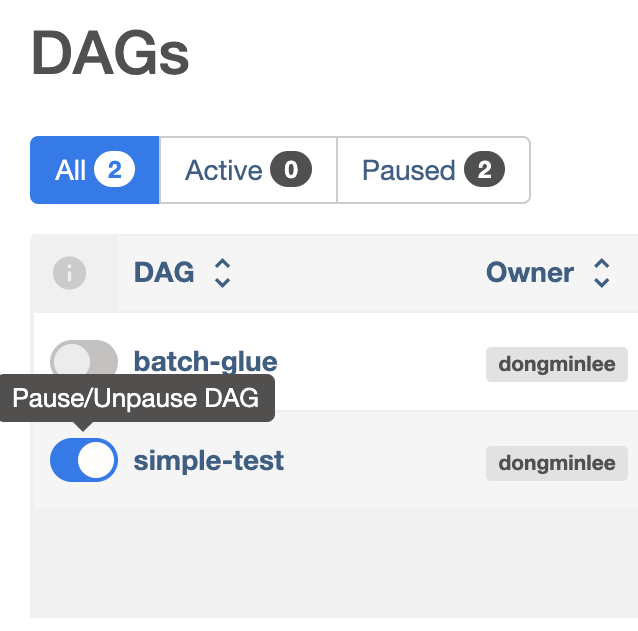
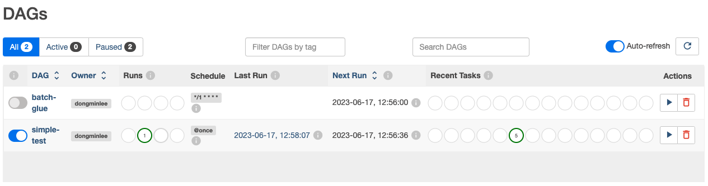
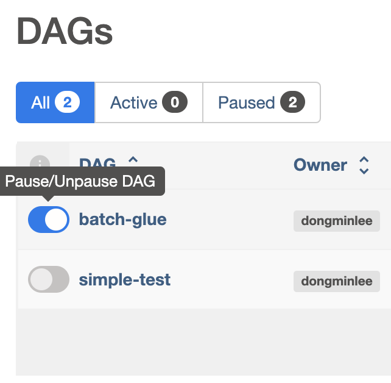
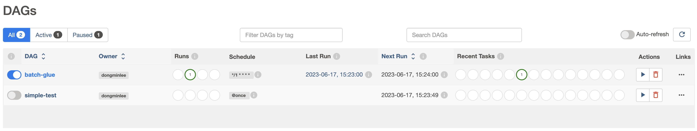

# Simple DataOps Docker

Landscape TBD

## Prerequisites

- Install [docker](https://docs.docker.com/engine/install/).

## Preparation

Install Python 3.10 on [Pyenv](https://github.com/pyenv/pyenv#installation) or [Anaconda](https://docs.anaconda.com/anaconda/install/index.html) and execute the following commands:

```bash
$ make init     # setup packages (need only once)
```

## Infra Setup

```bash
$ make compose          # create all the containers (need only once)
```

You can delete the containers.

```bash
$ make compose-clean    # delete the containers
```

### 1. Mongo DB

You can access `localhost:8081` from a web browser and log in as `admin` for both ID and password and then view the data that is being added to the `mongo` database in the Mongo DB through the data generator.

<center>  </center>

<center>  </center>

### 2. Airflow

You can access `localhost:8008` from a web browser and log in as `admin` for both ID and password.

<center>  </center>

<center>  </center>

Run the dags according to the detailed case studies below.

## Case Study

### 1. Simple Test

You can run on a simple dag called `simple-test` that you see on the main screen of airflow. You can also see the dag in `src/dags/1_simple_test/simple_dag.py`, defined as several tasks with the python and bash operators.

The schedule interval of the dag is `@once`, so when the dag is executed, it only works once at first. (references: [DAG Runs in Airflow](https://airflow.apache.org/docs/apache-airflow/1.10.1/scheduler.html#dag-runs) and [Cron in Wikipedia](https://en.wikipedia.org/wiki/Cron#CRON_expression))

So let's run the dag. You can unpause the dag by clicking `Pause/Unpause DAG`.

<center>  </center>

After a few seconds, you can confirm that the dag has successfully ended on the main screen of airflow.

<center>  </center>

### 2. Batch Glue

You can run a `batch-glue` dag that extracts, transforms, and loads (ETLs) data like [AWS Glue](https://aws.amazon.com/glue). You can also see the dag in `src/dags/2_batch_glue/dag.py` and the code for the task that runs on the bash operator in the dag in `src/dags/2_batch_glue/pipeline.py`.

The task that works in the dag is to extract the wine data in Mongo DB, transform the type of data, and then load it into Maria DB.

The dag runs every minute because the schedule interval for the dag is specified as (*/1 * * * *) every minute. (We don't manually run it.) In other words, the dag ETLs data between Mongo DB and Maria DB every minute.

So let's run the dag. You can unpause the dag by clicking `Pause/Unpause DAG`.

<center>  </center>

After a few seconds, you can confirm that the dag has successfully ended on the main screen of airflow.

<center>  </center>

Finally, you can access Maria DB and see that data is added every time the dag is executed.

```bash
$ docker exec -it mariadb bash
root@742cd8f602a7:/# mariadb -u maria -p
Enter password: maria
Welcome to the MariaDB monitor.  Commands end with ; or \g.
Your MariaDB connection id is 32
Server version: 10.6.13-MariaDB-1:10.6.13+maria~ubu2004 mariadb.org binary distribution

Copyright (c) 2000, 2018, Oracle, MariaDB Corporation Ab and others.

Type 'help;' or '\h' for help. Type '\c' to clear the current input statement.

MariaDB [(none)]> use maria
Reading table information for completion of table and column names
You can turn off this feature to get a quicker startup with -A

Database changed
MariaDB [maria]> select * from wine_data limit 10;
+----+---------------------+--------------------------+---------+------------+------+-------------------+-----------+---------------+------------+----------------------+-----------------+-----------------+------+------------------------------+---------+--------+
| id | time                | mongo_id                 | alcohol | malic_acid | ash  | alcalinity_of_ash | magnesium | total_phenols | flavanoids | nonflavanoid_phenols | proanthocyanins | color_intensity | hue  | od280_od315_of_diluted_wines | proline | target |
+----+---------------------+--------------------------+---------+------------+------+-------------------+-----------+---------------+------------+----------------------+-----------------+-----------------+------+------------------------------+---------+--------+
|  1 | 2023-06-17 15:41:11 | 648d5587d7f2b36f4504969c |   14.23 |       1.71 | 2.43 |              15.6 |       127 |           2.8 |       3.06 |                 0.28 |            2.29 |            5.64 | 1.04 |                         3.92 |    1065 |      0 |
|  2 | 2023-06-17 15:41:13 | 648d5589d7f2b36f4504969d |    13.2 |       1.78 | 2.14 |              11.2 |       100 |          2.65 |       2.76 |                 0.26 |            1.28 |            4.38 | 1.05 |                          3.4 |    1050 |      0 |
|  3 | 2023-06-17 15:41:15 | 648d558bd7f2b36f4504969e |   13.16 |       2.36 | 2.67 |              18.6 |       101 |           2.8 |       3.24 |                  0.3 |            2.81 |            5.68 | 1.03 |                         3.17 |    1185 |      0 |
|  4 | 2023-06-17 15:41:17 | 648d558dd7f2b36f4504969f |   14.37 |       1.95 |  2.5 |              16.8 |       113 |          3.85 |       3.49 |                 0.24 |            2.18 |             7.8 | 0.86 |                         3.45 |    1480 |      0 |
|  5 | 2023-06-17 15:41:19 | 648d558fd7f2b36f450496a0 |   13.24 |       2.59 | 2.87 |                21 |       118 |           2.8 |       2.69 |                 0.39 |            1.82 |            4.32 | 1.04 |                         2.93 |     735 |      0 |
+----+---------------------+--------------------------+---------+------------+------+-------------------+-----------+---------------+------------+----------------------+-----------------+-----------------+------+------------------------------+---------+--------+
5 rows in set (0.004 sec)
```

### 3. TBD

## For Developers

```bash
$ make check          # all static analysis scripts
$ make format         # format scripts
$ make lint           # lints scripts
```
